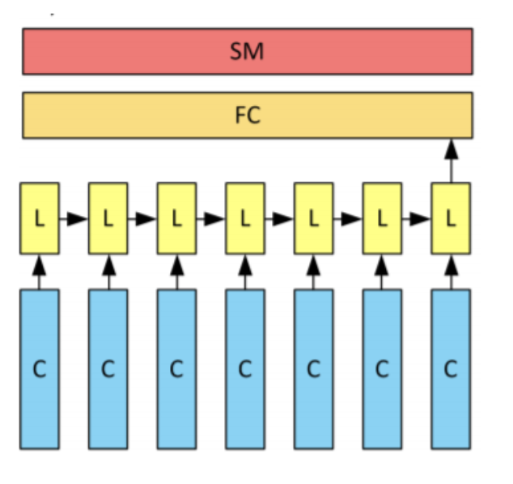

# EEG-based-Brain-Computer-interface
Kaggle Challenge for the Master of Data Science, Univ. Lille/Centrale Lille - 2021: 

# Goal of the project: 

The datas consist of EEG signals recorded on patients who where asked to think of mooving their left/right hand/foot. 

For each recording, 64 electrodes are placed on the brain. The alpha, beta and gamma frequency bands are recorded on each electrode at 7 different timestamps.  
For each frequency band, we have a 2D projection of the brain's activations on the 64 electrodes. 

The datas are processed to be of shape (Nb patient, nb frequency bands, nb time stamps, x axis, y axis}) = (N, 3, 7, 32, 32). 

The datas contains $\textbf{spatial, frequential and temporal}$ information. We tried to take into account these different types of informations when selecting and designing the right deep learning architectures.  

The goal is to predict wether the patient was asked to move its left/right hand or foot (4 classes to predict). 

# Method: 

## First Model: CNN exploiting only spatial and frequential information. 

We average the data along the time_stamps dimension to get rid of the temporal information. 
We train and finetune a CNN based architecture. 

## Second model:  CNN + LSTM exploiting spatial, frequential and temporal information.

- CNN + LSTM : Bashivan P, Rish I, Yeasin M, Codella N (2016): Learning Repre- sentations from EEG with Deep Recurrent-Convolutional Neu- ral Networks. In arXiv:1511.06448 [cs]. arXiv: 1511.06448.

## Final approach: Ensemble Learning: 

We take the average score of the output of each model. 

# Ranking: 

https://www.kaggle.com/c/eeg-based-brain-computer-interface/overview

We obtained the first place solution with 0.951 accuracy on the private laderboard.

